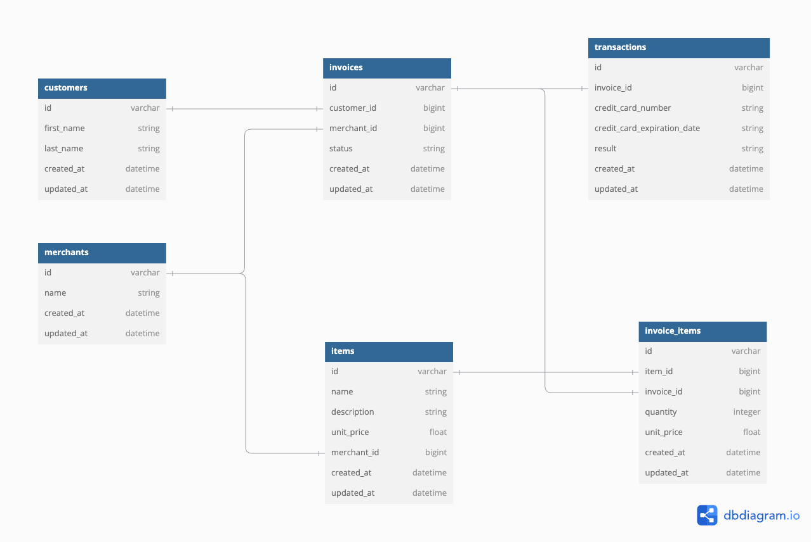

# README

### Project Description
In this group project, Little Shop, our team worked on building an E-Commerce application using service-oriented architecture, where the back and front ends are separate and communicate via APIs.

### System Dependencies and Tools
* Ruby version: 3.2.2
* Rails: 7.4.x 
* Database: PostgreSQL 
* Additional Gems: `pry, debug, simplecov, rspec-rails, shoulda-matchers, faker, factory_bot`
* Testing/Sending HTTP requests: Postman

### Essential Setup and Development Commands
* Configuration: `rails new little_shop -T -d="postgresql" --api`
* Database initialization: `rails db:create db:migrate db:seed db:schema:dump`
* Run the test suite: `bundle exec rspec`
* Run your development server: `rails s`

### Learning Goals
* Use ActiveRecord and SQL to write queries that deal with one-to-many database relationships
* Expose API endpoints to CRUD database resources
* Validate models and handle sad paths for invalid data input
* Test both happy and sad path functionality based on JSON contracts
* Use MVC to organize code effectively, limiting data logic in controllers and serializers
* Time Management
* Breaking down large projects into small pieces
* Breaking down a problem into small steps
* Practice individual research (reading documentation, articles, videos, mentors)

### Contributors
Terra Manning https://github.com/TDManning
Montana Pfeifer https://github.com/Montana-Pfeifer
Paul Knapp https://github.com/Paul-Knapp
Devlin Lynch https://github.com/devklynch
Oscar Patterson https://github.com/ossar3

